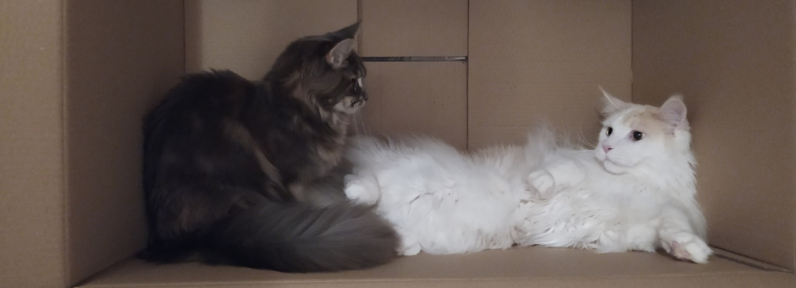

<h1 align="left">Hi 👋, I'm Rafał Białowski</h1>
<h3 align="left">A passionate fullstack developer from Poland</h3>

 

- 🌱 I’m currently learning **C#** and mastering **Symfony**
- 👨‍💻 My portfolio is available at [https://musikhood.github.io/portfolio-rb/#/](https://musikhood.github.io/portfolio-rb/)
- 📫 How to reach me **rafal.bialowski2@gmail.com**
- ⚡ Fun fact **I love cats and my hobby is playing games**

<h3 align="left">Something about me:</h3>
I graduated from the school with title of IT technician.  
I’m going to start my studies in computer science.  
Programming is my passion and it really brings me joy.  
I’m interested in creating responsive websites and making clean and  
reusable code. I’m willing to learn new technologies or frameworks.  
I’m currently working for 1.5 years as Fullstack developer
